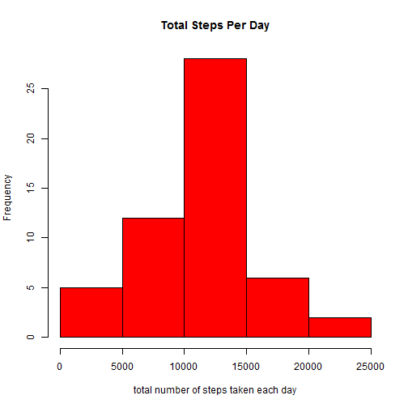
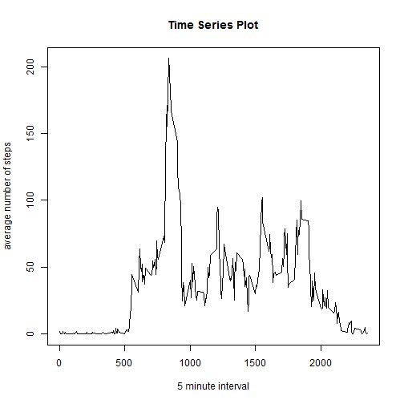
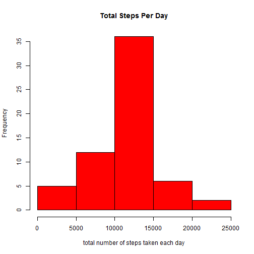

###Loading and preprocessing the data

```r
library(dplyr)
library(lattice) 
library(knitr)

setwd("D:/Data Science/05 Reproducible Research/Course Project 1")

data <- read.csv("./activity.csv")
data$date <- as.Date(data$date)
data_na <- na.omit(data)
```

###1. What is mean total number of steps taken per day?


####1.1 Calculate the total number of steps taken per day


```r
grouped <- data_na %>% group_by(date)
sums <-grouped %>% summarise_each(funs(sum), steps)
```
####1.2 Make a histogram of the total number of steps taken each day


```r
hist(sums$steps,xlab = "total number of steps taken each day",main ="Total Steps Per Day", col = "red")
```

 

####1.3 Calculate and report the mean and median of the total number of steps taken per day

Mean

```r
mean_steps <- round(mean(sums$steps))
print(mean_steps)
```

```
## [1] 10766
```
Median

```r
median_steps <- round(median(sums$steps))
print(median_steps)
```

```
## [1] 10765
```


###2.What is the average daily activity pattern?

####2.1 Time series plot 

```r
grouped_interval <- data_na %>% group_by(interval)
average_steps <-grouped_interval %>% summarise_each(funs(mean), steps)

plot(average_steps$interval, average_steps$steps, ylab="average number of steps", xlab="5 minute interval", type = "l", main = "Time Series Plot") 
```

 

####2.2 5-minute-interval with highest number of steps


```r
head(arrange(average_steps, desc(steps)), 1)
```

```
## Source: local data frame [1 x 2]
## 
##   interval    steps
## 1      835 206.1698
```

###3. Missing Values
####3.1 Number of rows with missing values

```r
sum(is.na(data$steps))
```

```
## [1] 2304
```

####3.2 - 3.3 Create a new data set with the missing data filled in

```r
average_combined <- average_steps

for (i in 1:60) {
        average_combined <- rbind(average_steps, average_combined)
}

data_filled <- data

data_filled$steps <- ifelse(is.na(data$steps), average_combined$steps, data_filled$steps)
```

####3.4 Make a histogram and calculate/report the mean and median total number of steps taken per day

```r
filled_grouped <- data_filled %>% group_by(date)
filled_sums <- filled_grouped %>% summarise_each(funs(sum), steps)

hist(filled_sums$steps,xlab = "total number of steps taken each day",main ="Total Steps Per Day", col = "red")
```

 

```r
filled_mean_steps <- round(mean(filled_sums$steps))
filled_median_steps <- round(median(filled_sums$steps))
```
new mean:1.0766 &times; 10<sup>4</sup>
old mean:1.0766 &times; 10<sup>4</sup>
new median:1.0766 &times; 10<sup>4</sup>
old median:1.0765 &times; 10<sup>4</sup>

Since I used the mean of the steps for the interval over all days the new mean has the same value like the old one. The new median differs from the old one since I used the mean() function to compute the average steps per interval.


###4. Are there differences in activity patterns between weekdays and weekends? 

####4.1 Create a new factor variable in the dataset with two levels - "weekday" and "weekend" indicating whether a given date is a weekday or weekend day.


```r
data_filled$weekday <- weekdays(data_filled$date)

data_filled$weekday <- ifelse(data_filled$weekday ==   "Montag" , "weekday" , data_filled$weekday)
data_filled$weekday <- ifelse(data_filled$weekday ==   "Dienstag" , "weekday" , data_filled$weekday)
data_filled$weekday <- ifelse(data_filled$weekday ==   "Mittwoch" , "weekday" , data_filled$weekday)
data_filled$weekday <- ifelse(data_filled$weekday ==   "Donnerstag" , "weekday" , data_filled$weekday)
data_filled$weekday <- ifelse(data_filled$weekday ==   "Freitag" , "weekday" , data_filled$weekday)
data_filled$weekday <- ifelse(data_filled$weekday ==   "Samstag" , "weekend" , data_filled$weekday)
data_filled$weekday <- ifelse(data_filled$weekday ==   "Sonntag" , "weekend" , data_filled$weekday)
```
####4.2 Make a panel plot containing a time series plot (i.e. type = "l") of the 5-minute interval (x-axis) and the average number of steps taken, averaged across all weekday days or weekend days (y-axis).


```r
filled_grouped_weekday <- data_filled %>% group_by(interval, weekday)
new_average <-filled_grouped_weekday %>% summarise_each(funs(mean), steps)

new_average_weekday <- new_average[new_average$weekday!= "weekend" , ]
new_average_weekend <- new_average[new_average$weekday!= "weekday" , ]


attach(new_average)
xyplot(steps~interval|weekday,
  	ylab="Number of steps", xlab="interval", 
    type='l',
   layout=c(1,2))
```

 
